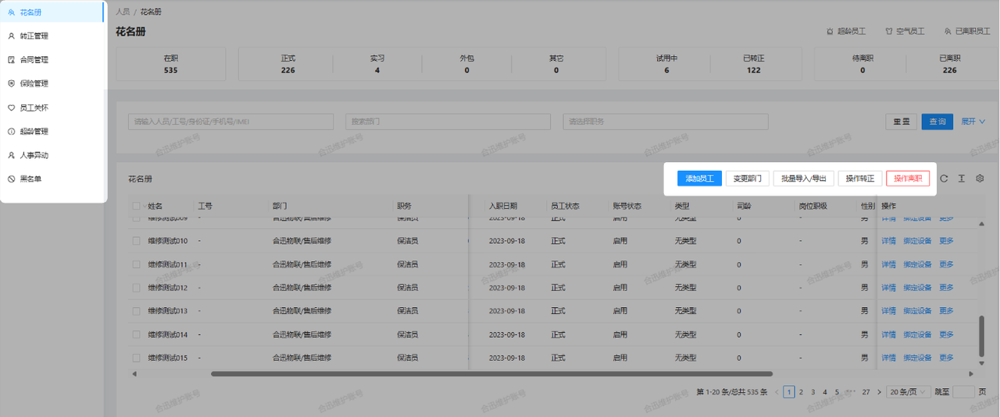

### 1.用户管理 
#### 1.1 账号创建与管理
系统支持为人员创建个性化账号，并根据其岗位和权限进行分配和管理。管理人员可以为用户设定访问权限，确保数据安全和信息的合理分配。
#### 1.2 角色分配与权限控制
不同的人员角色（如保洁员、班组长、管理员等）可以设置不同的权限，确保人员只能访问与其职责相关的功能和数据。
### 2. 人事异动
系统记录并管理人员的入、转、调、离等信息，确保每次人事异动都有据可查，流程清晰，支持随时查看人员的历史岗位变更记录。
### 3. 合同管理
系统能够管理人员的劳动合同，包括合同签署，到期提醒，续签及终止等功能，确保合同管理的合规性和时效性。
### 4.保险管理
对于需要购买商业保险的人员，系统提供商业保险的管理功能，记录每位人员的保险方案和保险公司信息，确保保险管理的透明。

