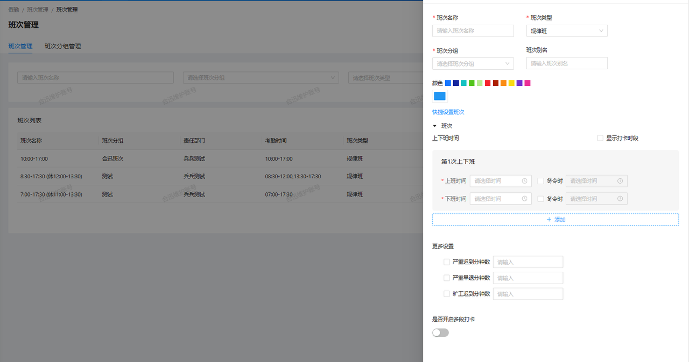
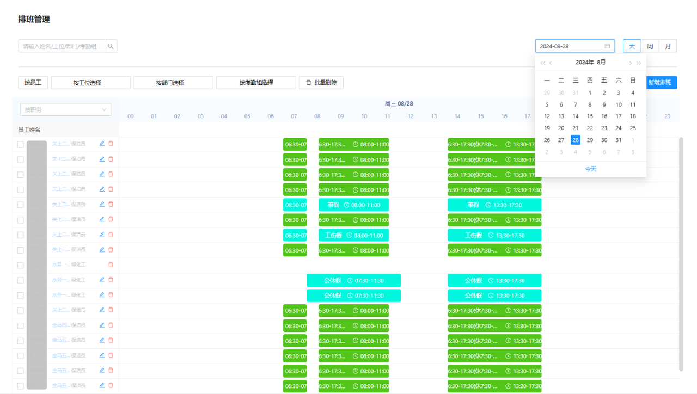
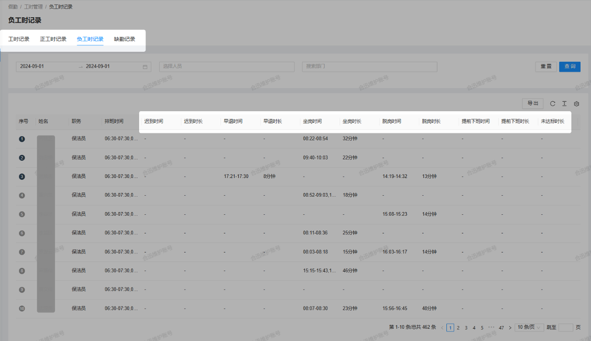
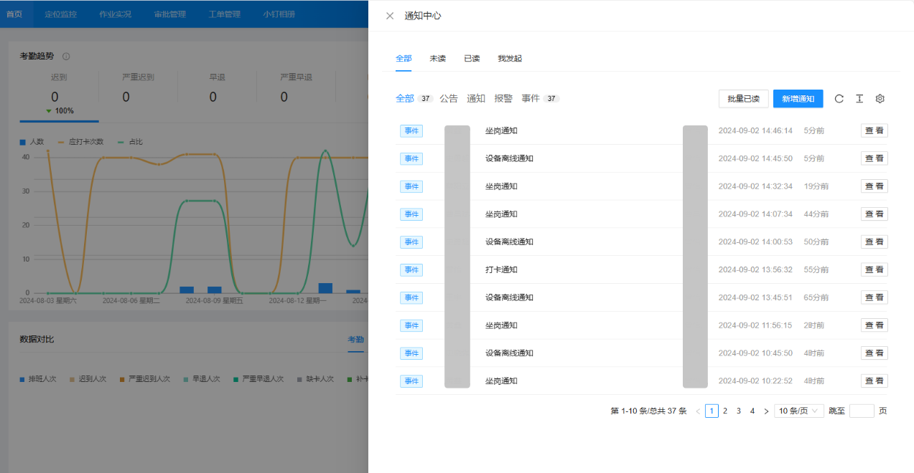
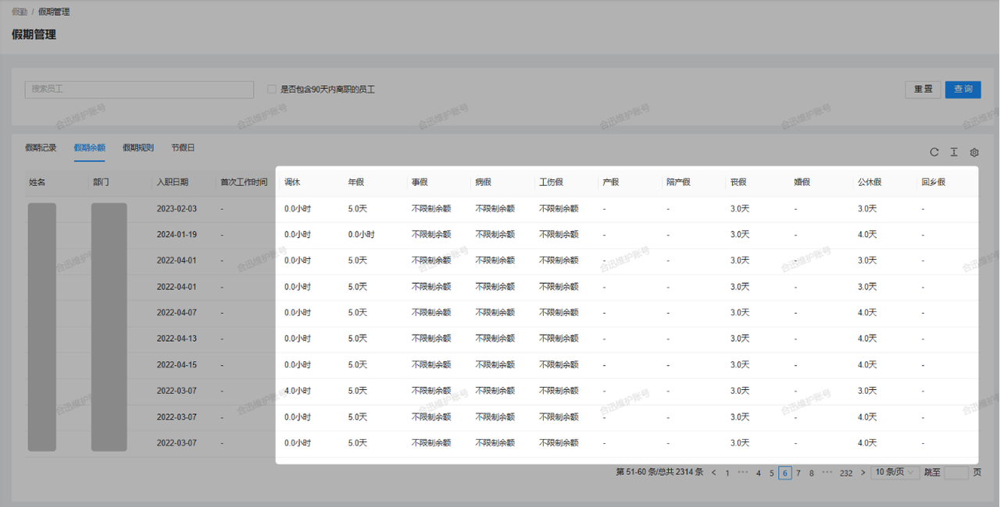

### 1. 考勤打卡
#### 1.1 定位设备自动打卡
人员只需要佩戴小钉工牌，进入指定工位后，系统会自动识别并打卡，无需人工干预，从而实现精准的签到和签退。
#### 1.2 手机APP定位打卡
通过手机安装App，手机可作为定位工牌。当人员进入工位区域，系统将自动为其打卡，显著提升灵活性与便捷性。
#### 1.3 WIFI/蓝牙扫描打卡
人员只需扫描指定的Wi-Fi或蓝牙信号，系统便能自动打卡，无需连接网络或设备，适用于复杂的室内作业环境。
#### 1.4 人脸识别打卡
系统采用人脸识别技术，确保打卡人员身份的准确性。同时，它能够自动检测人员是否在指定的工位范围内。只有在身份和工位均匹配时，系统才会进行打卡，杜绝虚假打卡的可能性。（人脸识别打卡功能仅在移动设备的小程序和App上支持）。
#### 1.5 互助打卡
针对于人脸识别打卡的功能，为了照顾那些没有智能手机的人员，系统新增了互助打卡功能。有权限且拥有智能手机的人员可以通过人脸识别功能帮助他人打卡，确保所有人员，无论是否拥有智能设备，都能够顺利完成打卡操作。
#### 1.6 外勤打卡
外勤打卡功能允许有权限的人员在任何地点进行打卡，而无需到达特定工作区域。这种灵活的打卡方式特别适用于执行外勤任务、巡逻或处理紧急情况的工作人员，确保他们的考勤记录准确无误，不受地理位置的限制。
#### 1.7 核岗（查岗）打卡
核岗打卡基于人脸识别技术，在排班时间段内对员工进行身份验证。系统会根据管理员设置的规则自动生成核岗任务，人员需在指定的时间内完成核岗，通过实时对比面部信息，确保员工在指定岗位上，防止替岗行为，维护考勤的真实性。
### 2 排班管理

#### 2.1 固定班次
系统支持设定并自动生成员工的固定工作班次，确保每个班次有足够的人员覆盖。这种模式适用于需要稳定、重复的工作安排，以确保持续的工作效率和人员资源的合理分配。
#### 2.2 灵活排班
系统允许根据实际需求进行动态调整，适应不同的作业时间需求。这种模式适合没有固定作业时间的人员，能够根据业务变化或突发情况灵活调整排班，提升工作灵活性和适应能力。
#### 2.3 排版管理

系统提供了实时更新和调整排班安排的功能。管理者在为人员分配好考勤组后即可直接为人员排班，排班完成后，管理者可以通过考勤日历直观地查看每位员工的排班信息，以及追溯查看历史排班记录。
### 3. 工时记录

#### 3.1 精准工时记录
系统精确录入每位员工的实际工时，包括工作开始时间和结束时间。所有工时数据都被详细的记录在报表中，确保每条记录都准确无误。
#### 3.2 数据追溯与审计
工时数据可追溯，系统能够提供详细的历史记录和审计跟踪。这一功能确保了管理人员在需要时能够检索和审核工时记录，保障数据的完整性和透明性。
#### 3.3 异常行为自动识别
系统自动识别并记录人员在正常工作时间内的异常行为，如未实际工作的时间段。所有异常行为都被详细记录，支持后续的分析和管理，帮助管理人员及时发现并解决工时管理中的问题。
### 4. 通知提醒

#### 4.1 及时通知
系统能够实时推送通知，确保用户及时了解重要信息和人员的异常考勤行为。无论是系统公告、任务提醒还是紧急通知，用户都能第一时间收到相关的信息，确保及时响应和处理。
#### 4.2 自定义提醒设置
用户可以根据个人需求和偏好设置通知提醒。系统允许自定义提醒内容和通知方式，如公众号、短信或应用内推送，满足不同用户的个性化需求。
### 5. 假期管理
#### 5.1 假期记录与跟踪
系统自动记录并跟踪每位员工的假期申请和审批情况，包括请假类型、请假时间、批准状态等详细信息。管理人员可以轻松访问假期记录，查看员工的完整假期历史，从而提高查询和审计的效率。
#### 5.2 更新假期余额

系统会根据员工的假期使用情况自动计算并实时更新假期余额。管理人员可以随时查看人员的假期余额，确保假期管理的透明度和准确性，避免误用或超额使用假期。
### 6. 加班管理
#### 6.1 加班申请与审批
为了优化加班管理流程，我们系统允许员工提交加班申请，确保员工的额外工作时间得到记录和补偿。提交后的申请会自动流转至审批系统，由授权的管理人员进行审核。
#### 6.2 加班记录与跟踪
系统将自动记录所有加班活动的详细信息，包括加班日期、时长、加班类型及加班人员等。管理人员可以轻松查看员工的加班记录，以便进行统计、审计和后续处理。