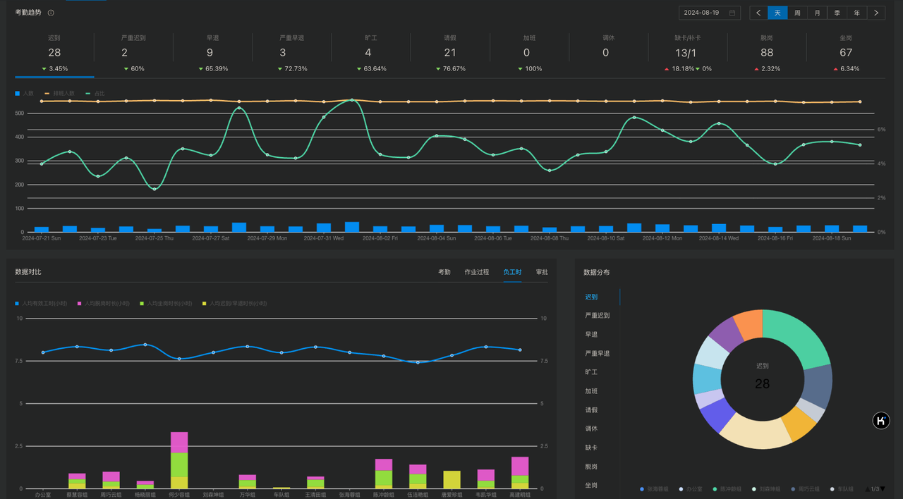
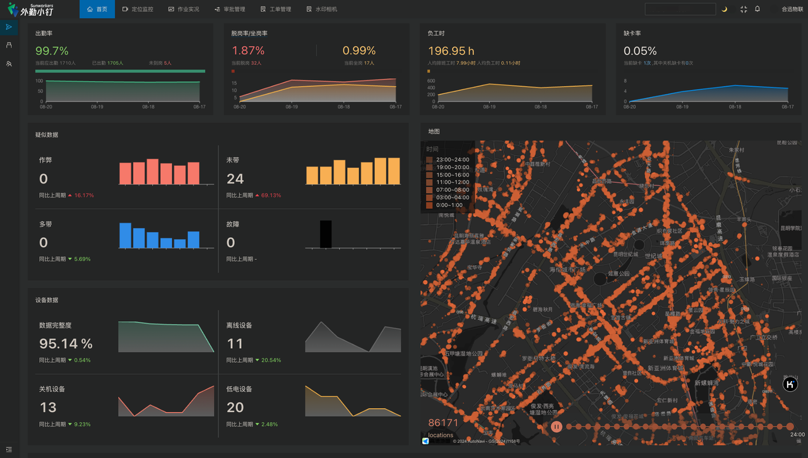

### 1. 综合数据报表
系统提供了全面的数据报表，涵盖考勤、工时、作业任务等各类数据。
### 2. 数据对比分析
#### 2.1 多维度对比
系统提供了多个维度的数据对比功能，帮助识别在不同维度下的数据差异和异常。

#### 2.2 图表展示与趋势分析
通过图标和图形化来展示数据，使得分析结果更加直观易懂，帮助管理人员迅速把握关键指标，同时支持对数据进行时间序列分析，识别趋势。

### 3. 数据导出功能
#### 3.1 自定义导出内容
系统允许用户根据实际需要，自定义导出报表的内容和字段。例如，用户可以选择导出特定时间段内的考勤数据、工时记录、作业完成情况等。还可以根据部门、项目或人员等条件筛选数据，确保导出的内容精准且有针对性。
#### 3.2 批量导出功能
对于需要频繁导出大量数据的用户，系统提供了批量导出功能。用户可以一次性选择多个报表或数据集进行导出，减少手动操作的时间，提升工作流程的流畅性。