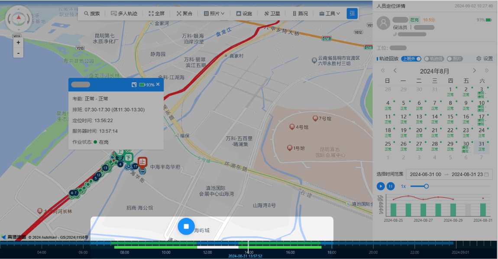
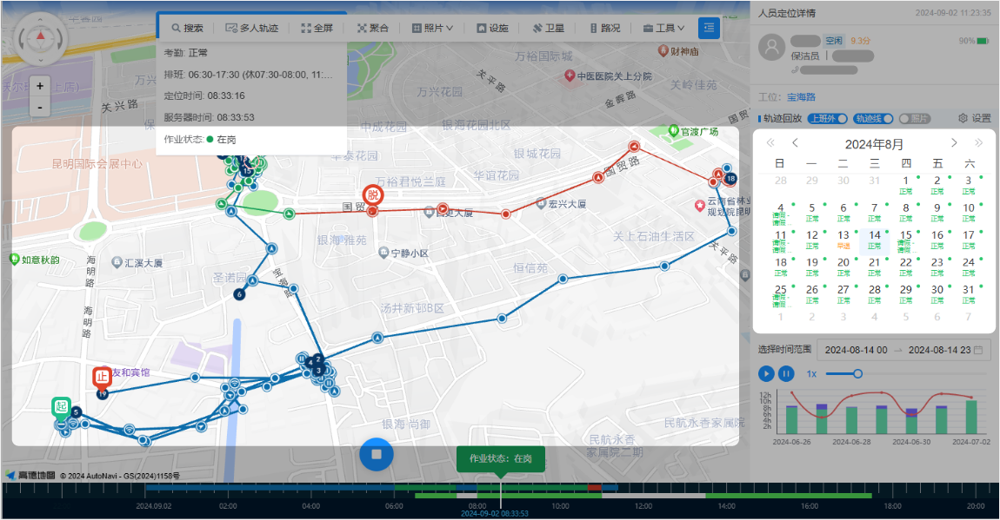
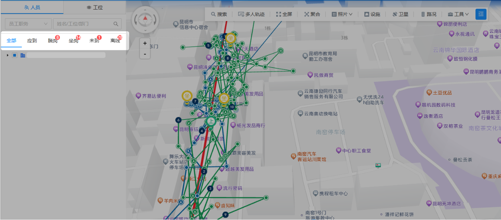
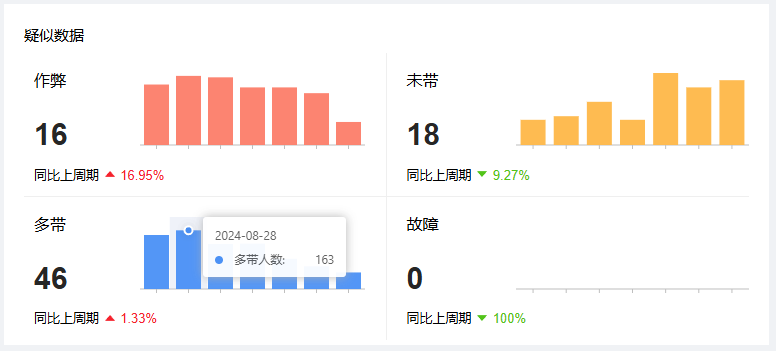

### 1.考勤时间轴
#### 1.1 活动记录可视化
为了在定位监控中清晰地查看某位人员的考勤状况，系统引入了考勤时间轴的概念。时间轴下方显示了人员的排班时间段，而上方则展示了实际的在岗情况，通过对比这两个时间轴，管理人员可以直观地了解到人员在各个时间段的活动记录，如是否发生了坐岗、脱岗等异常情况，从而更加准确地掌握人员的工作状态。

### 2. 高精度定位
#### 2.1 精准定位
定位的准确性是企业全过程管理人员考勤的关键。环卫小钉能够以极高的精度获取人员的位置信息，误差范围极小，无论是在室内复杂环境还是户外开阔区域，都能够提供可靠的定位数据。
### 3. 定位频率管理
#### 3.1 动态频率调整
支持自定义工牌定位数据的上传频率，允许用户根据实际需求调整数据上传的频率，从而在不同场景下实现数据精准度和传输效率的最佳平衡。
### 4. 轨迹回放

#### 4.1 历史轨迹保存
系统将自动记录并存储每位员工的移动轨迹，确保用户能够随时查看和分析人员的历史位置记录。该功能支持长期存储定位数据，便于轨迹回溯和数据管理，确保数据的完整性和可追溯性。
#### 4.2 便捷回放
轨迹回放功能使管理者能够轻松查看人员在特定时间段内的移动路径。此功能支持选择特定的日期和时间段，回放并跟踪人员的历史轨迹，帮助分析其工作模式和行为习惯。
#### 4.3 轨迹分析
轨迹回放功能不仅能够展示人员的移动路线，还能标注出签到点、签退点以及异常行为发生的具体位置。
#### 4.4 状态监测
在地图上可以查看员工的实时位置，以及员工的当前的状态信息，包括个人资料、负责的工位、当前工作状态（如在岗、脱岗、空闲等）、工时记录、作业里程、作业步数、设备电量等。这些数据为管理者提供了全面的员工状态监测，使得人员管理更加精确。
#### 4.5 异常提示
当员工发生异常行为或定位数据不符合预设标准时，系统将自动发出预警通知，使管理者能够立即采取措施，避免潜在风险、及时纠正操作偏差。
### 5. 实时考勤分类

#### 5.1 及时考勤状态识别
系统能够实时监控所有排班人员的考勤状态，迅速识别出那些没有到达工作岗位或出现离线情况的人员。 通过定位数据的实时更新，并与排班信息进行对比，确保每位员工的出勤情况都在监控范围内，为管理者提供及时、精准的考勤信息。
#### 5.2 智能分类与标及
系统具备实时考勤分类功能，能够对在岗员工进行智能分类，并自动标记异常行为的人员，如未到岗、脱岗、坐岗、一人多带以及异常作业等情况。
### 6. 动态展示人员移动轨迹
#### 6.1 动态轨迹展示
在定位监控中，系统可以在地图上动态播放特定时间段内单个人员的移动路径，使管理人员直观地查看人员的活动路线和位置变动，从而能解决传统考勤管理中无法即时监控的问题。
#### 6.2 异常情况标及
系统能够在地图上清晰地标记人员在工作时间内出现的异常情况，如停留在非工作区域或路径偏离预定路线等。帮助管理人员迅速识别和定位问题地根源，确保在分析异常行为时没有延误。
### 7. 宏观展示出勤人员情况
#### 7.1 地图聚合视图
系统通过地图上的聚合功能，将不同区域的作业人数进行展示，各区域的人员数据通过图形化的方式汇总显示，使管理人员能够一目了然地了解每个区域的人员分布情况。
#### 7.2 快速了解区域情况
 系统自动汇总各个区域的人员数据，并提供即时更新的信息。无论作业区域是广泛分散还是高度密集，系统都能在地图上清晰地显示当前的人员情况。
 ### 8. 数据异常检测算法

#### 8.1 空气员工（一人多带）检测
该算法能够分析同一时段内多名人员的考勤情况，识别是否存在一名员工携带其他多名员工地设备来进行打卡的情况，算法通过分析设备的活动轨迹、信号特征和时间同步性等因素，精准检测并标记空气员工的异常情况，防止任何形式的代打卡或伪造出勤记录。
#### 8.2 疑似作弊检查
系统采用智能算法监测员工的考勤数据和行为模式，以识别可能的作弊行为。通过分析签到和签退时间的异常模式、较短时间内的步数量很大等情况，系统能够快速识别出疑似的虚假出勤情况，从而提高考勤数据的准确性。
#### 8.3 疑似未带检测
系统通过定位数据及步数量，监测员工在工作期间是否佩戴定位设备，若某员工在工位附件未佩戴设备，系统会将该员工标记为“疑似未带”，同时系统会提醒管理人员进一步核实。
#### 8.4 疑似故障检测
该算法负责检测设备的电量状态和数据上传频率，以识别设备是否出现故障。例如，如果某个设备长时间未上传数据但仍然显示有电时，系统将自动提醒管理人员进行检查。