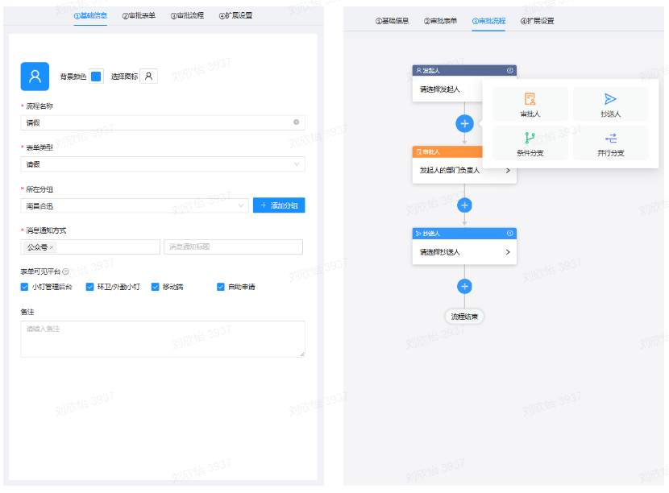
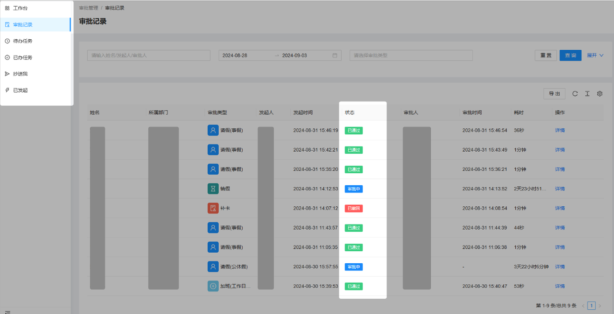

### 1.流程控制

#### 1.1 自定义审批流程
系统允许用户根据实际需求灵活设计和定制审批流程。用户可以设置多级审批环节，明确每个环节的审批权限和责任人，并针对不同的申请类型或业务需求配置相应的审批步骤，确保流程高效性和适应性。
#### 1.2 条件化审批
审批流程支持条件化设置，用户可以根据特定条件或业务规则触发不同的审批路径。例如，某些申请可能需要额外的审查或审核，系统能够自动根据设定的条件调整审批流程，确保每个申请按照预定规则高效处理。
### 2. 自动化提醒

#### 2.1 审批阶段自动通知
系统会在每个审批阶段自动发送通知和提醒，以确保审批人及时处理申请。通知方式包括公众号、短信或系统内进行推送，防止因审批延迟而导致业务中断，保障流程的顺畅运行。
#### 2.2 处理进度跟踪
自动化提醒不仅涵盖申请的处理，还包括审批进度的跟踪。系统会向相关人员发送更新通知，让他们了解申请的当前状态和下一步需采取的行动，从而提高审批的效率和透明度。
### 3. 实时状态跟踪
#### 3.1 审批状态跟踪
系统提供实时审批状态跟踪功能，用户可随时查看申请的当前状态和处理进度，包括审批通过、待审批、审批拒绝等状态，以便及时跟进和处理，确保流程的高效推进。
#### 3.2 历史记录保存
系统保存了详细的审批历史记录，包括每个审批环节的操作时间和相关文档。管理人员可以随时查阅历史记录，进行审计和分析。
### 4. 全设备审批支持
无论是在电脑、手机、还是其他智能设备上，用户都能随时随地处理审批任务，确保审批流程的连续性和便捷性。
