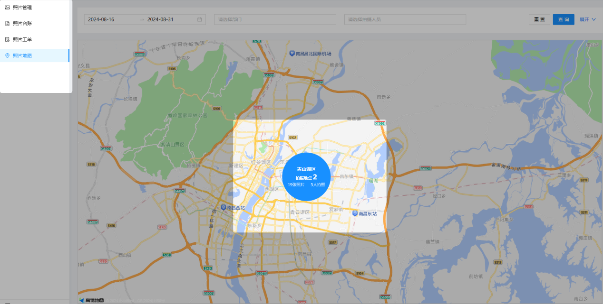
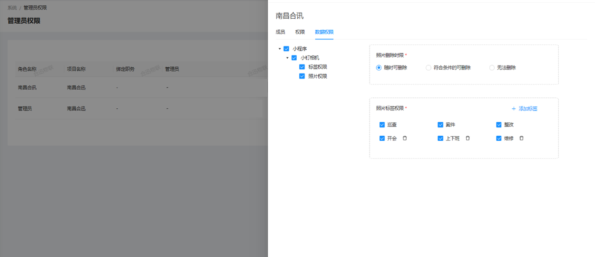

### 1. 水印信息标注
员工在地点拍照时，系统会为照片添加包含人员姓名、拍摄时间和位置信息的水印，确保记录的准确性和真实性。
### 2. 照片自动存档
每次拍摄的照片将自动保存到本地，同时同步上传到小钉相册中，确保照片安全存储，方便随时查阅和管理。
### 3. 照片类型自定义

系统允许用户在拍摄时选择不同的照片类型，如巡查、案件整改等，并支持后台自定义照片类型。
### 4. 实时更新与同步
拍摄的照片将立即更新到小钉相册，确保用户能随时查看最新内容，并支持多个设备间的同步查看，方便协作。
### 5. 高级筛选与搜索
相册提供多种筛选条件，用户可以根据日期、照片类型、拍摄人员等条件快速查找特定照片，极大提升管理效率。
### 6. 照片标注与分类
每张照片都自动附带拍摄时的地理位置信息，用户可在相册中查看，并支持导航至拍摄地点。此外，系统会根据照片类型自动归类，方便归档和管理。