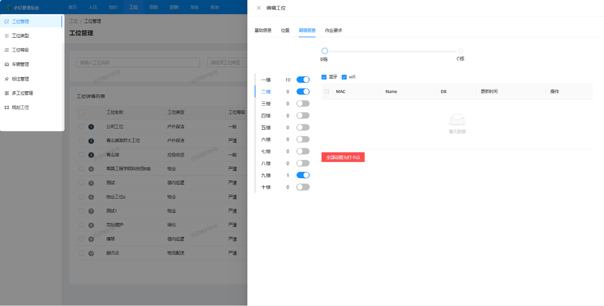
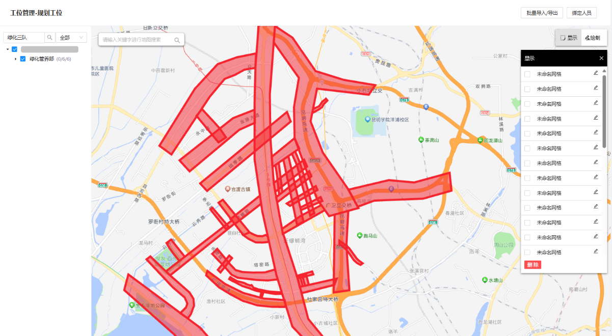
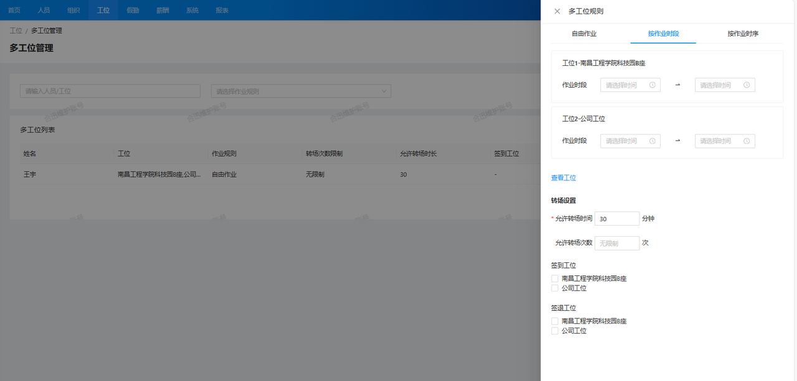

### 1. 平面与立体工位管理

#### 1.1 多维度工位管理
系统支持对平面工位和立体工位的双重管理。无论是传统的平面工位，还是复杂的多层立体工位，系统都能精确映射和高效管理，满足不同场景下的工位配置需求。
#### 1.2 动态工位配置
工位管理不仅限于静态展示，还支持实时动态调整，随着工作区域的变化或办公空间的变动，系统可以灵活调整工位的分配和配置，确保工位布局与实际需求同步更新，提升空间利用率。
### 2. 自定义绘制电子围栏

#### 2.1 合规的地图资源
系统使用的地图资源均符合国家相关法律法规，确保不涉及任何涉密信息。在提供精准作业范围划定的同时，也严格遵守法律要求，保障用户的合法使用。
#### 2.2 精准划定作业范围
系统具备自定义作业范围绘制的功能，用户可以直接在地图上精确绘制和调整每个工位的作业区域。这一功能支持多种形状和尺寸的自由定义，能够根据实际作业需求准确划分每个工位的服务范围，确保作业区域的精确性。
#### 2.3 灵活适应各种场景
无论是在户外清洁区、楼层巡逻区，还是社区安保区等。系统都能够根据实际场景灵活设置作业范围。通过精准划分作业区域，员工能够明确自己的工作区域，避免因责任不清或交叉作业导致的工作效率降低。
### 3. 提供个性化作业区域分配，匹配不同人员的工作需求
#### 3.1 多工位管理

在实际的工作场景中，员工往往需要在不同的工位之间移动和作业。为避免因转场时间不当而导致的异常行为或工位之间的衔接问题，系统在多工位管理中提供了转场时间设置的功能。管理者可以为负责多个工位的人员设置合理的转场时间，避免员工因移动而造成的脱岗行为。此外，系统还允许管理者为不同工位严格设置设定作业时段和在岗时长，确保员工在规定时间内作业。
#### 3.2 作业类型分类
系统允许根据每个员工的任务需求和工作环境，定制化设置不同的作业区域或作业路线。系统支持将工作任务划分为多种作业类型，如保洁、巡逻、维修和设备维护等。每种作业类型都有其独特的要求和标准。例如，保洁工作可能要求高频次的清洁操作，而设备维护则可能涉及复杂的技术支持和安全检查。系统能够为每种作业类型制定专属规则，确保作业标准化。
#### 3.3 设置作业规则
根据不同的作业类型，系统可以灵活设置工作时间和排班安排。对于24小时运营的场所，系统可以为安保任务制定轮班制度；对于保洁任务，可以设置清洁频率和卫生检查要求；对于巡逻任务，系统可以制定定点检查和异常报告规则，确保作业的规范性。