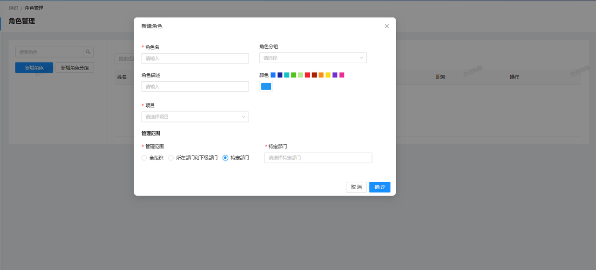

### 1. 多层级权限设置
对于需要频繁导出大量数据的用户，系统提供了批量导出功能。用户可以一次性选择多个报表或数据集进行导出，减少手动操作的时间，提升工作流程的流畅性。
#### 1.1 角色权限分级管理
系统支持对用户角色进行多层级的权限配置，涵盖系统管理员、部门经理、普通员工等。每个角色拥有独立的访问和操作权限，确保各类用户只能访问和操作自己权限范围内的数据和功能。
#### 1.2 模块化权限控制
系统允许对每个模块、功能进行精细化的权限设置。用户可以根据实际需求，自定义每个角色的具体权限，如查看、编辑、删除等操作权限。
### 2. 灵活的角色管理

#### 2.1 自定义角色创建
用户可以根据组织的结构和业务需求，自行创建角色。这些角色不仅满足系统管理的标准需求，还可以根据特定的工作流程、项目要求或团队架构进行灵活定制。
#### 2.2 多样化角色设置
系统支持多种角色的创建与管理，能够满足不同层级和部门的需求。无论是高层管理者、部门负责人，还是普通员工，都可以依据其职责和工作内容定义相应的角色。
### 3. 安全的数据保护
#### 3.1 数据隔离
系统确保不同用户角色之间的数据访问隔离，防止未经授权的用户查看或修改敏感信息。通过精细化的权限设置，保障数据的安全性与隐私性。
### 4. 自定义权限策略
#### 4.1 策略制定
根据企业的具体需求，系统可以自定义权限策略，包括访问控制规则、申请项、审批流程等，确保权限管理符合实际业务需求；此外，系统还支持权限设置的动态调整，以应对业务变化或组织结构调整。管理员可以实时更新权限配置，确保系统权限管理始终与当前需求保持一致。
