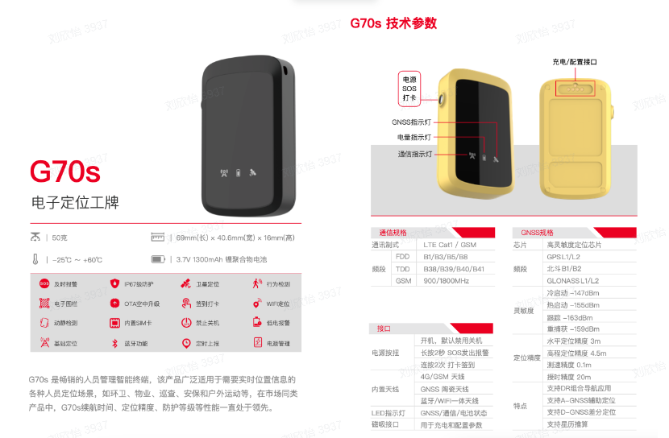
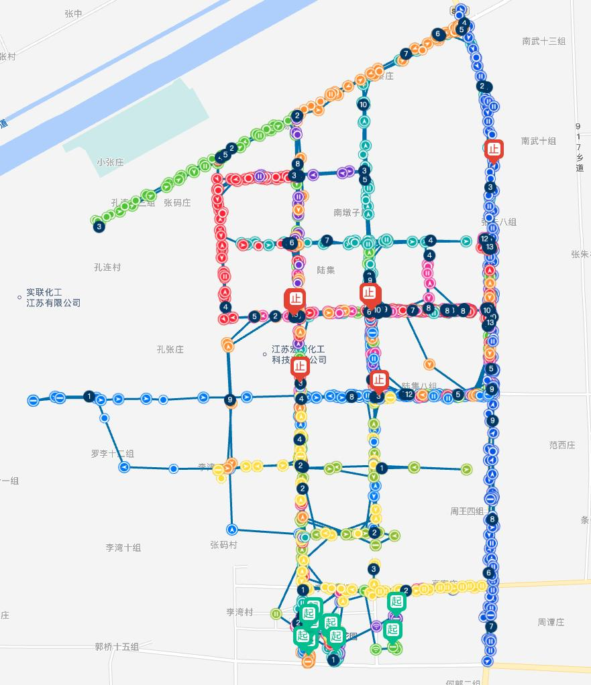
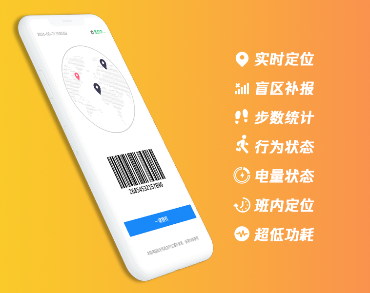

### 1. 硬件电子工牌 
品牌：环卫小钉   型号：G70s ，为环卫作业复杂场景打造

**功能特点：**  
1、超长续航：正常工作环境满电可连续工作5-8天；  
2、超级防护：在不需要防水套的情况下，可在水中浸泡48小时；  
3、定位精准：室外室内定位相结合，定位准确，芯片层抑制漂移算法。减少漂移带来的考勤、工时数据不准确现象。  

### 2. 数字工牌
品牌：环卫小钉   型号：小钉Work

**功能特点：**    
1、超低功耗：独创电源优化算法，功耗大幅降低，续航更长久；  
2、系统兼容：支持安卓和IOS系统；  
3、后台运行：在终止前台运行后，数字工牌可继续在后台稳定运行上报数据；  