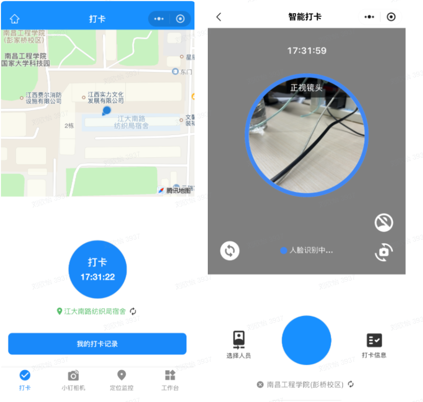
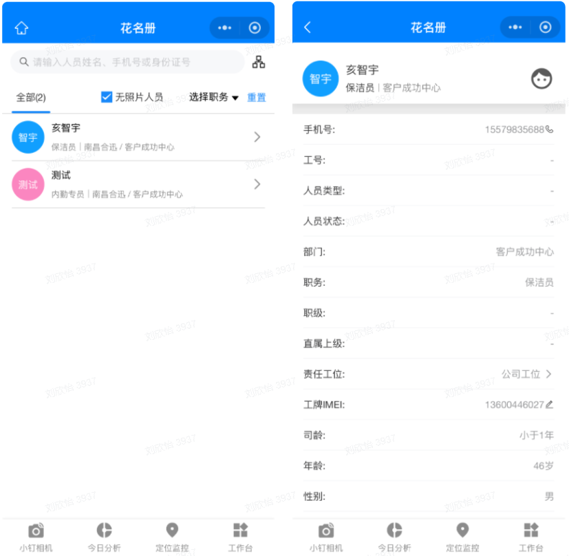
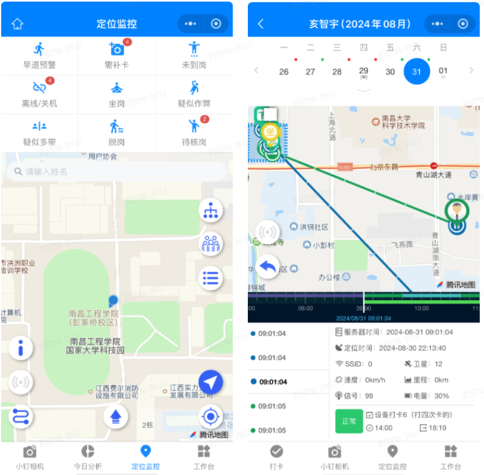
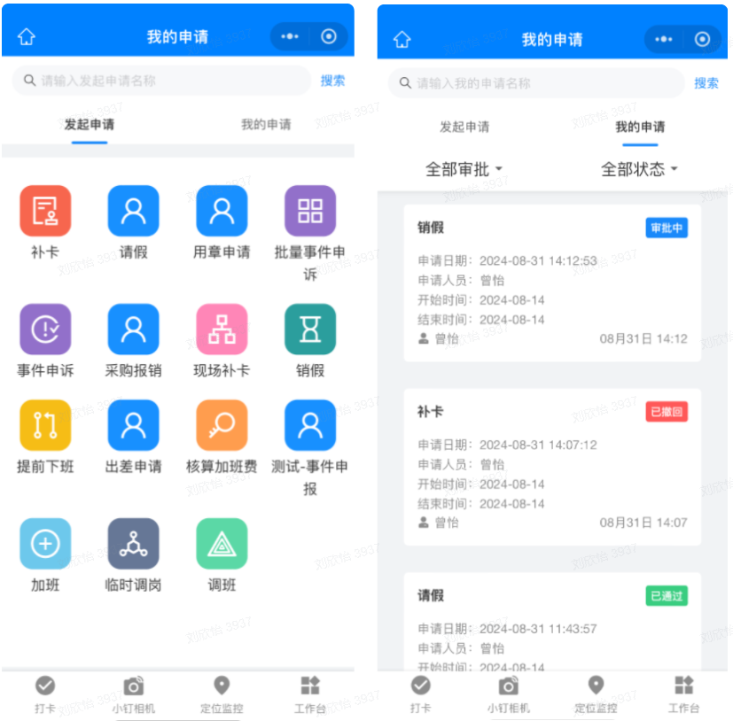
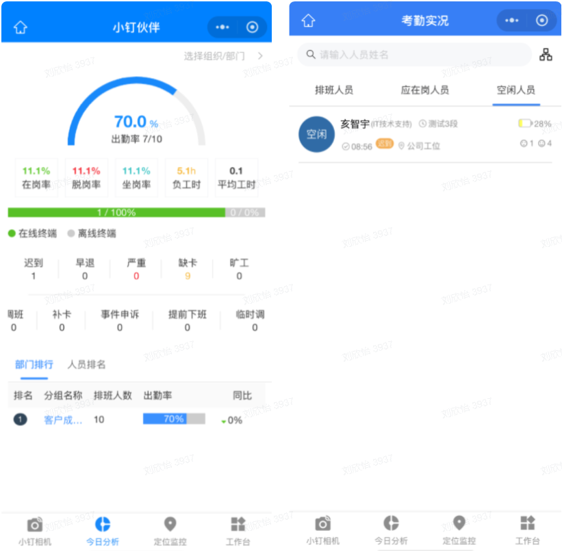
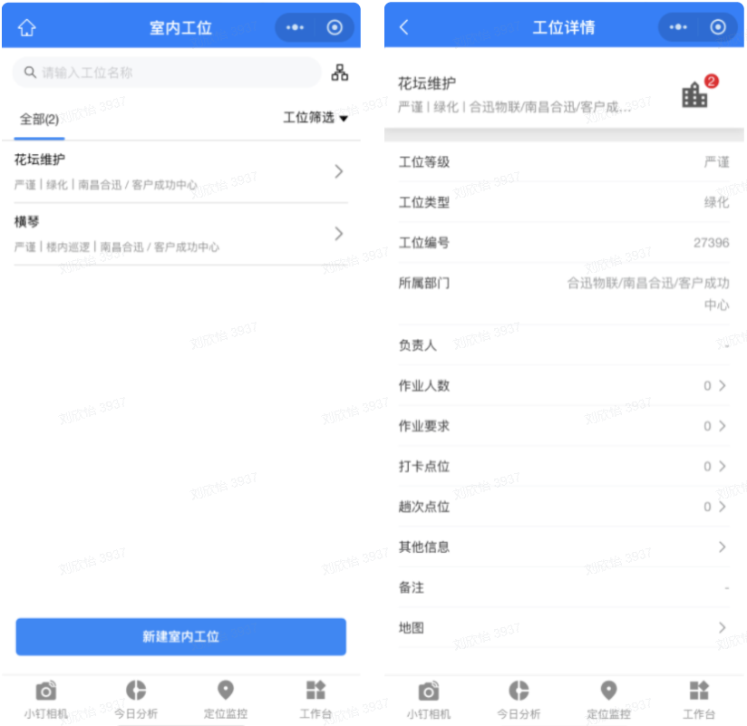
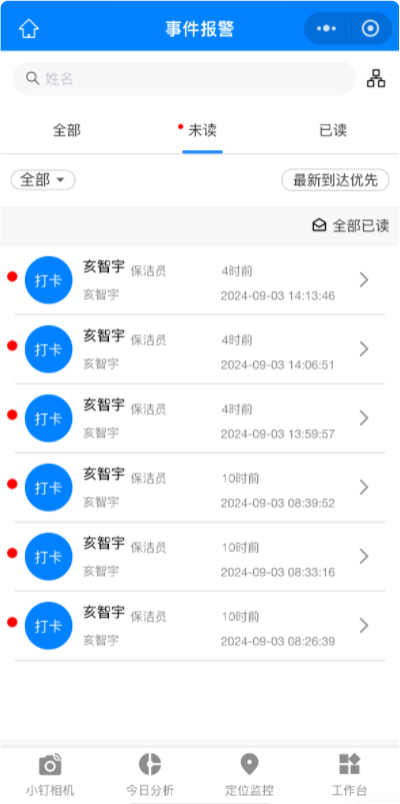
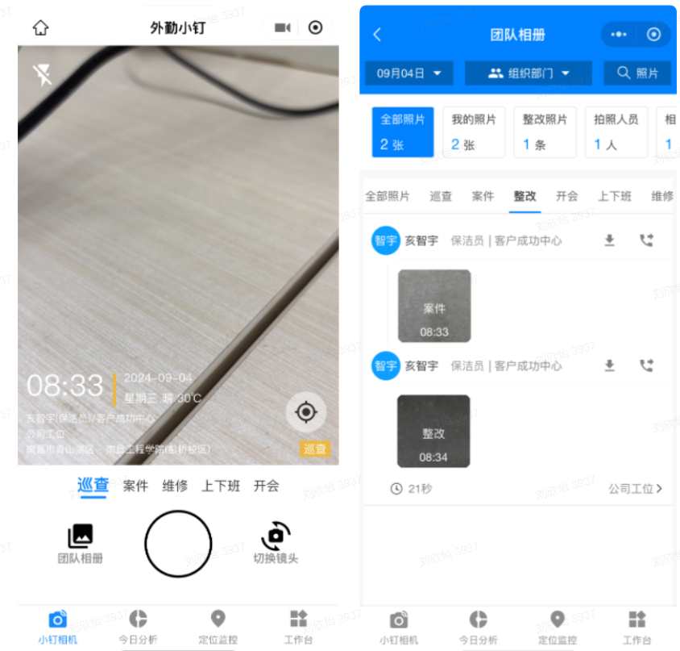

### 1.智能打卡

#### 1.1 自助打卡
自动打卡功能允许员工通过移动端设备轻松完成打卡。用户可以选择自动打卡，系统会根据其位置信息自动记录出勤状态。此外，员工还可以利用人脸识别技术进行打卡，确保身份验证的准确性和安全性。
#### 1.2 互助打卡
互助打卡功能为同一部门的员工提供了协助打卡的便利。员工可以在需要时通过移动端帮助其他同事进行打卡。在使用该功能时，系统将不仅验证帮助者的身份，还会通过人脸识别技术确保被帮助员工的身份，以及确认员工是否在其工位内。此功能的引入确保了员工在特殊情况下完成考勤。
### 2. 花名册

#### 2.1 人员信息
在移动端的员工花名册中，管理者和员工可以查看所在部门中所有人员的详细个人信息，包括职务、职级、直属上级、责任工位、工牌等。
#### 2.2 上传照片
员工可以通过移动端拍摄并上传个人照片，作为人脸识别的原始照片。这确保了系统中的身份信息始终保持最新，进一步增强了打卡和考勤管理的准确性。
### 3. 定位监控

#### 3.1 九宫格
九宫格中展示了各种实时预警信息，包括人员的迟到、早退情况以及未到岗、关机/离线、坐岗、脱岗等状态。所有信息都是实时更新的，便于管理者及时掌握当前人员的出勤情况，迅速作出应对。
#### 3.2 员工考勤情况
在移动端的定位监控中，管理者可以实时查看在岗人员的状态，了解每位员工的当前位置及具体的行进轨迹。
#### 3.3 历史轨迹记录
历史轨迹记录详细保存了员工的历史轨迹信息，允许管理者在移动端根据指定日期查看员工的轨迹情况、考勤情况以及异常行为发生的时间节点。
### 4.申请审批

#### 4.1 申请项
申请模块包含多种申请项目，如补卡、请假、事件申诉、加班、调班和调岗等，满足员工多样化的需求。
#### 4.2 审批中心
在审批中心，管理者可以查看员工发起的所有申请，查看各种申请的审批流程，简化审批流程。
### 5. 考勤分析

#### 5.1 今日分析
在今日分析模块中，系统详细展示了员工当天的出勤情况，包括实际到岗人数、缺勤人数和迟到人数等关键指标。通过百分比的方式，管理者可以一目了然地了解部门整体出勤率，便于快速评估当天的考勤表现。
#### 5.2 考勤实况
考勤实况模块实时展示了所有员工的在岗情况，系统将员工分为三大类：排班人员、应在岗人员和空闲人员。管理者可以快速查看每类员工的数量和状态。
#### 5.3 考勤统计
考勤统计以日、周、月三个时间维度展示该部门下人员的出勤情况。管理者可以根据不同的时间段查看员工的出勤记录，包括出勤率、缺勤率和迟到率等。
### 6. 工位管理

管理者可以在移动端的工位采集中新建立体工位，针对不同的楼层的不同区域设置不同的工位名称及相应的打卡点；在工位管理中可以查看每个工位的具体信息，包括工位类型，作业要求及负责人员等。
### 7. 公告通知

#### 7.1 公告
管理者可以编辑公告内容并设置公告时效，确保员工在打开移动端时能够及时获取最新公告，促进信息的透明共享。
#### 7.2 通知
管理者可以通过定时或立即发送的方式，向部门人员发布不同的通知，确保员工能够及时收到重要信息。
### 8. 事件告警

针对员工发生的异常行为，如迟到、早退、坐岗和脱岗等，系统可在后台配置相应的规则，并在移动端实时发送预警信息，帮助管理者及时发现和处理问题。
### 9. 小钉相机

#### 9.1 水印信息
利用小钉相机拍摄的每一张照片都自带水印，水印信息不仅包含拍摄者的姓名和职务信息，还记录了拍摄的时间和地点。
#### 9.2 照片类型
在小钉相机中，每张照片可以根据实际用途设置不同的类型，如巡查、开会、案件整改等。
#### 9.3 团队相册
所有通过小钉相机拍摄的照片会自动保存到本地以及团队相册中，确保照片不会丢失并方便后续访问；相册中的照片支持一键分享至微信等社交平台，用户可以与团队或客户共享拍摄内容；具备相应权限的人员可以查看不同同事拍摄的照片。团队相册中还提供多种搜索选项，允许用户按时间、照片类型或拍摄者等条件快速筛选所需照片。
### 10. 任务分配
对于那些需要每天变更工位的人员，管理者可以通过任务分配功能灵活地为员工安排工位。这一功能支持管理者在移动端或电脑端轻松创建和调整工位分配，以满足不同的工作需求和人员安排。管理者只需选择员工、指定新的工位，系统会自动更新每位员工的考勤信息。
