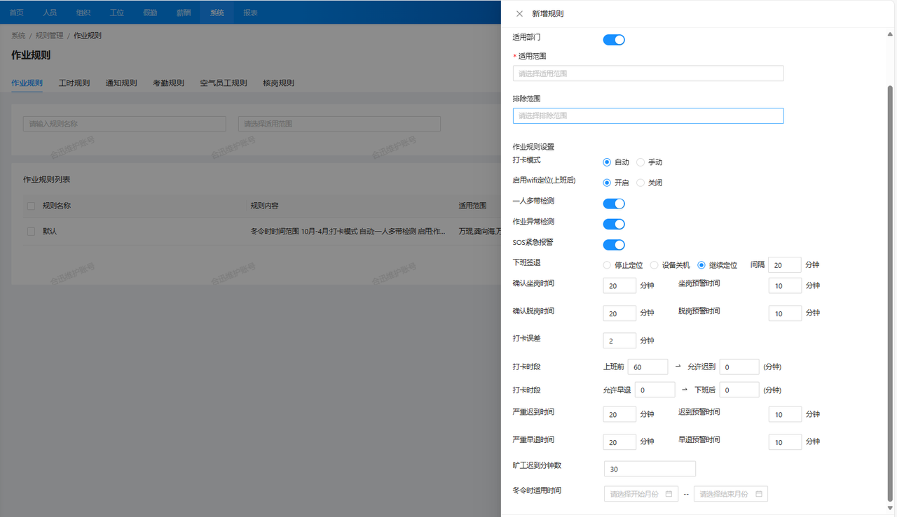
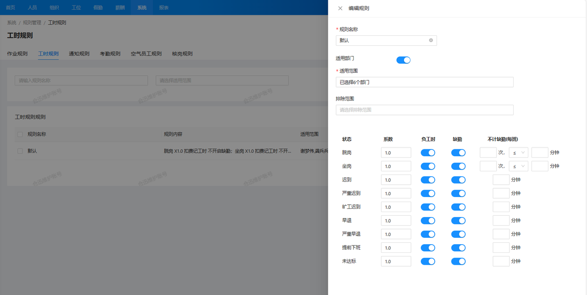
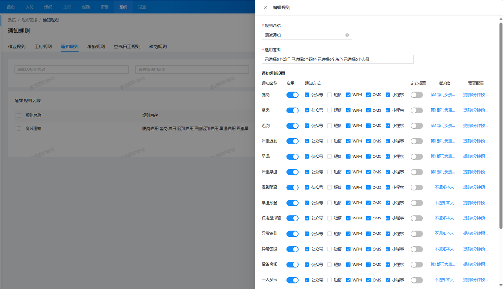
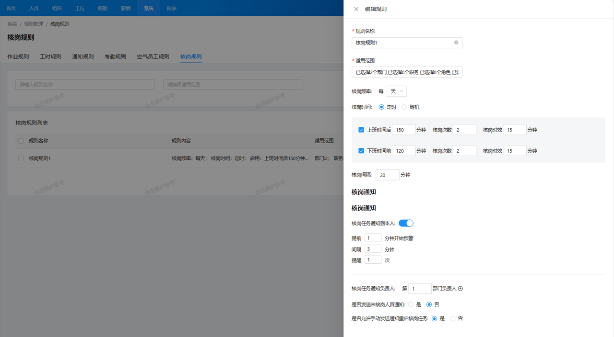
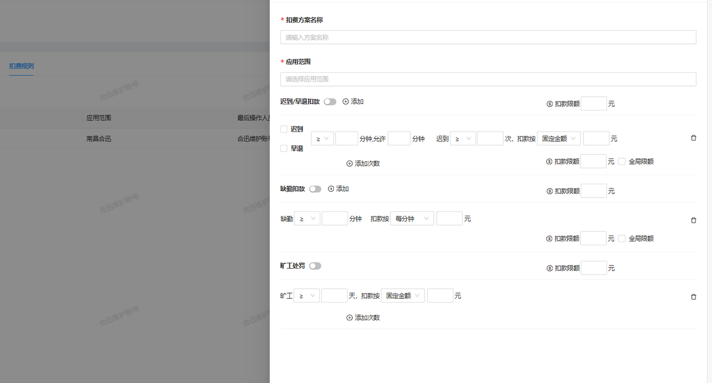
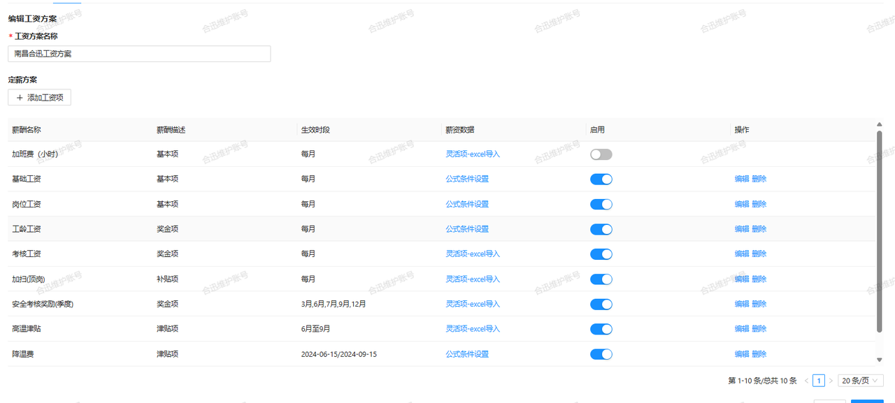
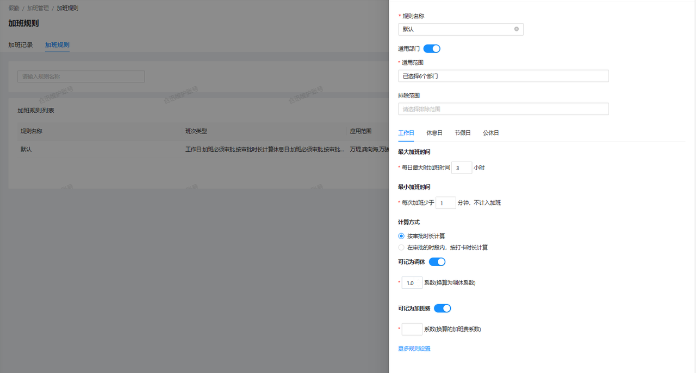
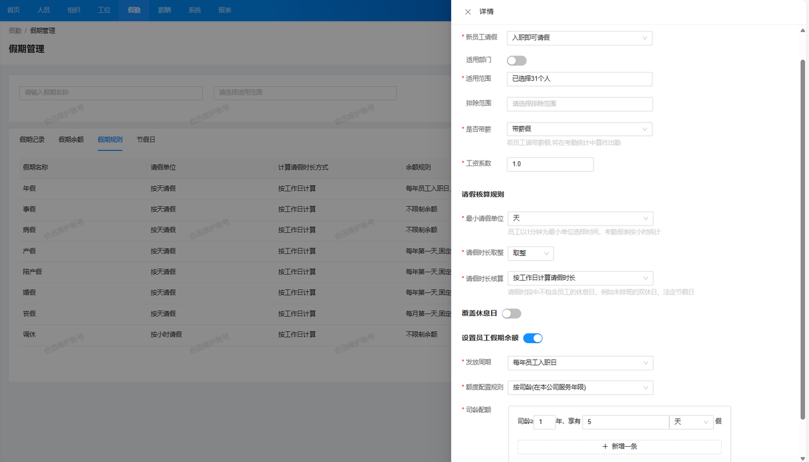

### 1. 作业规则

#### 1.1 异常检测
系统可以在作业规则中设置是否开启作业异常检测的功能，如一人多带检测（检测一名员工是否同时使用了多个定位设备）和SOS紧急报警功能。
#### 1.2 考勤时段
定义是否允许班外定位，以及是否对打卡时段进行限制，如提前多久签到视为有效打卡等；还可以设置打卡的允许时间范围，例如提前签到和迟到的计算规则。
### 2. 工时规则

根据各种异常考勤状态（如坐岗、脱岗、迟到、早退等），设置这些行为是否计入负工时，是否算作缺勤，以及允许的缺勤次数等。
### 3. 通知规则

系统可以在通知规则中配置各种预警信息的通知方式和通知人，包括设置通知的频率和提醒次数。
### 4. 核岗规则

核岗通知的发送时间可以根据实际需求进行设置，支持定时发送和随机发送两种方式。定时发送适用于规律性较强的工作场景，而随机发送则用于不定时检查，增加监督的不可预测性。
### 5. 扣费规则

系统为缺勤、迟到、早退等行为提供了明确且灵活的扣费规则设置。管理人员可以根据企业的政策和要求，设定详细的扣费标准，包括不同类型的违规行为对应的扣款金额，每一次扣费操作都会自动记录在案，并生成相应的报表。
### 6. 工资规则

系统支持自定义薪资结构，包括基本工资、奖金、津贴、扣款等项。管理者可以根据公司的薪酬政策，灵活设置薪资组成部分，以适应不同员工类别和复杂的薪资要求。
### 7.加班规则

系统支持多种加班补偿方式，包括加班工资、调休。管理人员可以根据公司政策设置补偿标准和规则。同时，系统能够根据设定的补偿规则自动计算员工的加班补偿金额，确保补偿计算的准确性。
### 8. 假期规则

系统允许管理员设置和管理节假日，包括国家法定节假日和公司内部特定假期。管理员可以根据实际需求自定义节假日，并确保所有人员在假期期间的工作安排和薪酬计算得到合理调整。
### 9. 空气员工规则
通过大数据分析，按照空气员工规则配置。系统可以挖掘疑似空气员工数据清单。